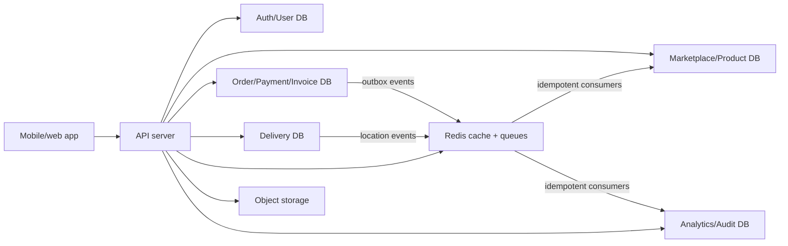

# ChowdharyMart Multiple Database Architecture

## Architecture Diagram

## Data Mapping

| Workload | Database | Data |
| --- | --- | --- |
| Auth/User | `AUTH_DATABASE_URL` | customers, sellers, riders, admins, sessions, OTP state, roles, warnings |
| Marketplace/Product | `MARKETPLACE_DATABASE_URL` | stores, approval state, products, product images, variants, categories, banners, coupons |
| Order/Payment/Invoice | `ORDER_DATABASE_URL` | carts, orders, order items, invoices, payment attempts, wallet ledgers, payouts |
| Delivery | `DELIVERY_DATABASE_URL` | partner assignments, live location snapshots, route state, delivery OTP state, proof of delivery |
| Analytics/Audit | `ANALYTICS_DATABASE_URL` | admin CRUD audit, security events, sales analytics, delayed delivery history |
| Object storage | `STORAGE_*` or `R2_*` | product photos, store photos, approved public rider profile photos, invoices |
| Redis | `REDIS_URL` | cache, order handoff queues, live tracking pub/sub, idempotency keys |

## Environment

Use the root `.env` file for real values. Never commit `.env`; commit only `.env.example`.

The app can run with only `DATABASE_URL` for local development. In production, set each workload URL separately:

- `AUTH_DATABASE_URL`
- `MARKETPLACE_DATABASE_URL`
- `ORDER_DATABASE_URL`
- `DELIVERY_DATABASE_URL`
- `ANALYTICS_DATABASE_URL`
- `REDIS_URL`
- `STORAGE_PROVIDER`, `STORAGE_BUCKET`, `STORAGE_PUBLIC_BASE_URL`

## Connection Modules

The DB package exposes these workload modules:

- `@workspace/db/databases/auth`
- `@workspace/db/databases/marketplace`
- `@workspace/db/databases/order`
- `@workspace/db/databases/delivery`
- `@workspace/db/databases/analytics`
- `@workspace/db/services/redis`
- `@workspace/db/services/storage`

Existing imports from `@workspace/db` still work. The default `db` points to the marketplace DB for backward compatibility.

## Schema And Migrations

The current schema is shared while the app is being split. Production migration steps:

1. Keep identity tables in Auth DB.
2. Move store/product/catalog tables to Marketplace DB.
3. Move order/payment/wallet/invoice tables to Order DB.
4. Move rider assignment, OTP proof, and location tables to Delivery DB.
5. Move append-only audit/event tables to Analytics DB.
6. Run Drizzle migration per DB URL with least-privilege users.

## Cross-Database Transaction Rule

Do not use distributed transactions. Use this pattern:

1. Write the local transaction and an outbox event in the same database.
2. Publish the outbox event through Redis queue.
3. Consumers must be idempotent using `eventId` and `orderId`.
4. If a downstream step fails, write a compensation event instead of mutating history silently.
5. Admin manual corrections must be audited in Analytics DB.

## Redis Keys And Events

Recommended prefixes:

- `chowdharymart:cache:product:{productId}`
- `chowdharymart:cache:store:{storeId}`
- `chowdharymart:queue:order-created`
- `chowdharymart:queue:seller-accepted`
- `chowdharymart:queue:rider-assigned`
- `chowdharymart:queue:payment-captured`
- `chowdharymart:tracking:order:{orderId}`
- `chowdharymart:idempotency:{eventId}`

Core events:

- `order.created`
- `seller.accepted`
- `seller.rejected`
- `delivery.partner.accepted`
- `delivery.location.updated`
- `delivery.otp.verified`
- `order.delivered`
- `payment.captured`
- `wallet.ledger.posted`
- `payout.requested`

## Storage Buckets

Recommended bucket folders:

- `products/{storeId}/{productId}/`
- `stores/{storeId}/`
- `riders/public-profiles/{riderId}/`
- `riders/private-verification/{riderId}/`
- `delivery-proof/{orderId}/`
- `invoices/{orderId}/`

Only approved public rider profile photos should be signed for customer map views. Private verification selfies and identity documents must never be exposed to customers.

## Health Checks

API endpoints:

- `GET /api/health`
- `GET /api/health/databases`
- `GET /api/healthz`

The database health endpoint checks each configured workload DB with `select 1`. It does not return connection strings or secrets.

## Admin Preservation

Existing admin data must not be overwritten by seed/demo users. Demo account creation stays disabled unless `ENABLE_DEMO_ACCOUNTS=true` is explicitly set.

## Production Steps

1. Create separate managed PostgreSQL databases.
2. Create least-privilege database users per workload.
3. Fill root `.env` from `.env.example`.
4. Configure Redis and object storage.
5. Run migrations against each DB.
6. Start API and verify `/api/health/databases`.
7. Enable backups, audit retention, and storage lifecycle policies.
