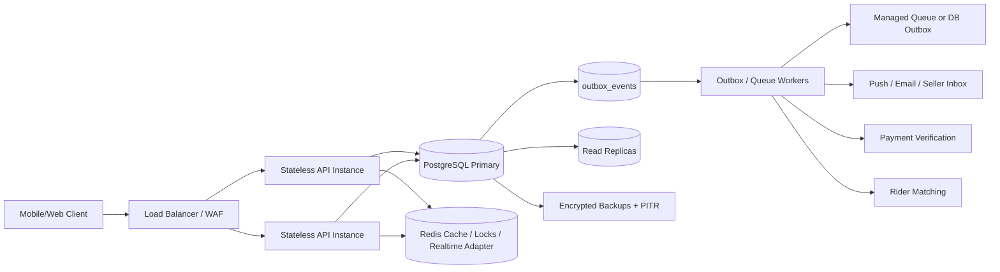

# Chowdhary Mart Production Readiness

## Architecture

## Implemented Foundation

- Public health endpoints are minimal: `/api/health`, `/api/health/live`, `/api/health/ready`.
- Admin-only diagnostics live under `/api/admin/health/*` and `/api/admin/operations/*`.
- Request/correlation IDs are returned on every request.
- Unhandled server failures return a safe reference ID, not stack traces.
- Checkout now requires `Idempotency-Key`.
- Duplicate checkout with same key and same payload returns the stored response.
- Same key with different payload is rejected.
- Order create uses a database transaction for order/items/tracking/cart clear/wallet/coupon/outbox/stock reservation.
- Product stock is decremented atomically with `stock >= qty`.
- Inventory reservation ledger is written for each item.
- `outbox_events` is written in the same transaction as the committed order.
- Local DB outbox worker can publish/retry/dead-letter events.

## Traffic Flow

1. Client sends request with auth token, request ID, and idempotency key for critical actions.
2. Load balancer routes only to healthy API instances.
3. API validates auth, role, resource ownership, service zone, and payload.
4. Critical write begins a PostgreSQL transaction.
5. Domain tables and outbox event commit together.
6. API returns only after durable commit.
7. Workers process outbox events with retry and dead-letter handling.
8. Realtime clients reconnect by fetching latest authoritative state from API/DB.

## Disaster Recovery Targets

- RPO target: 5 minutes for critical order/payment data when PITR is configured.
- RTO target: 30-60 minutes depending cloud provider restore speed.
- Backups must be encrypted, retained cross-region, and restore-tested.

## Incident Runbook

1. Declare incident and freeze risky deploys.
2. Check `/api/health/ready`, admin dependency health, queue depth, DB connection count.
3. If DB primary fails, switch to provider failover or restore PITR snapshot.
4. If Redis fails, keep order integrity through PostgreSQL and disable non-critical cache/realtime features.
5. If queue worker fails, keep orders in `outbox_events`; restart workers and watch queue age.
6. If payment provider fails, disable online payments and keep COD if business allows.
7. If bad deployment occurs, rollback app version and run migration rollback only if backward-compatible.
8. Preserve logs/audit evidence before destructive recovery.
9. Rotate affected secrets if breach is suspected.
10. Run reconciliation jobs before closing incident.

## Known Gaps Before Real Production

- Managed PostgreSQL backups/PITR must be configured in the cloud provider.
- Managed Redis/RabbitMQ/SQS/Kafka credentials must be supplied.
- PgBouncer or managed pooler must sit in front of PostgreSQL under high concurrency.
- Real 100,000-order burst test must run against staging infra, not this local machine.
- Admin MFA and full permission matrix still need deeper implementation.
- Wallet ledger should be expanded to immutable credit/debit/hold/release/reversal tables before real money launch.
